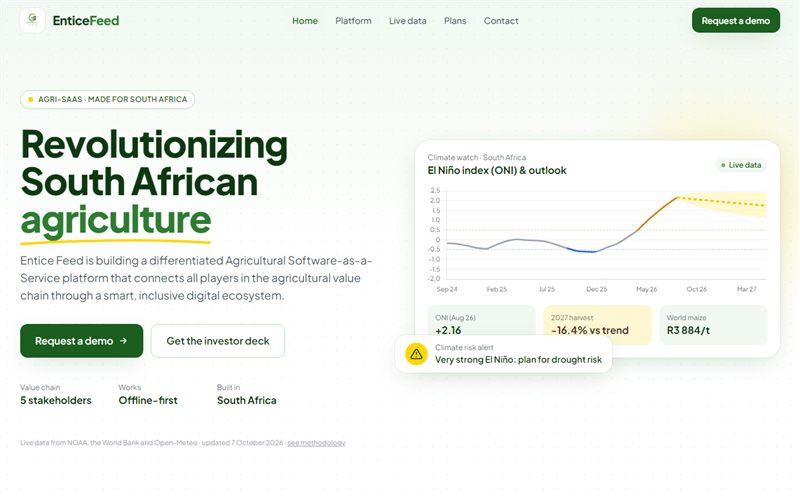

# Entice Feed: Agri-SaaS Website

   

Marketing and product website for **Entice Feed Pty Ltd**, a South African agricultural Software-as-a-Service start-up connecting farmers, input suppliers, buyers, financial institutions and government in one digital ecosystem.

**Live:** https://letlhogonolo-kgatshe.github.io/entice-feed-website/



## Sections

| Section | What it does |
|---|---|
| **Hero** | Value proposition, demo and investor-deck calls to action, and a product preview with a Chart.js yield forecast |
| **Impact stats** | Key figures that count up as they scroll into view |
| **How it works** | Three-step onboarding: profile, insights, then sell and finance |
| **Platform** | Six pillars of the core differentiation strategy |
| **Ecosystem** | Accessible tabs (arrow-key navigation) for each stakeholder group and what they get |
| **AI insights** | Real South African cereal yields since 2000 with El Niño seasons highlighted, and next season's projection |
| **Live data** | El Niño (ONI) outlook, a 6-month rand maize price forecast, an ECMWF seasonal rainfall outlook per growing region, and live 7-day weather and soil moisture |
| **Produce auctions** | Sample live lots with countdown timers and bidding |
| **Plant tracking** | Crop health dashboard with search, status filters and moisture levels |
| **Plans** | Smallholder, Commercial and Enterprise subscription tiers |
| **FAQ** | Expandable answers to common questions |
| **Contact** | Validated form that opens the visitor's email app with the enquiry pre-filled; CTAs pre-select the topic |

Auction lots and plant-tracking rows are labelled as sample data. The climate, yield and price figures are real.

## Live data & forecasting

`scripts/update-data.mjs` runs **every Monday** through GitHub Actions (`.github/workflows/update-data.yml`, which can also be run manually). It pulls free public data, fits the models and commits `data/agri-data.json`, which the page reads.

| Data | Source (free, no API key) |
|---|---|
| El Niño index (ONI), 1950–present | NOAA PSL / CPC |
| South Africa cereal yield, 1961–present | World Bank WDI `AG.YLD.CREL.KG` |
| Maize price, USD/t (monthly) | World Bank Pink Sheet |
| USD/ZAR | Frankfurter (ECB reference rates) |
| Seasonal rainfall forecast + 1991–2020 normals | Open-Meteo (ECMWF SEAS5, ERA5) |
| 7-day weather & soil moisture (fetched live in the browser) | Open-Meteo Forecast API |

**Models.** All are fitted from the data each run, so no effect is hard-coded:
- **El Niño outlook:** AR(1) persistence model on the monthly ONI.
- **Harvest outlook:** `log(yield) = a + trend·year + β·ONI(Nov–Feb)`. El Niño seasons cut SA cereal yields by about 9% per +1 ONI.
- **Price outlook:** 1–6-month log returns regressed on ONI and the gap from the 12-month average, with 80% ranges.

These are indicative decision-support figures, not financial or agronomic advice.

```bash
cd scripts && npm ci && cd .. && node scripts/update-data.mjs
```

## Tech

A single `index.html` (plus `data/agri-data.json`) with **Tailwind CSS** (CDN, custom brand theme), **Chart.js 4**, inline SVG icons and vanilla JavaScript. It has no build step. Accessibility features include a skip link, ARIA tabs, live regions, visible focus styles and `prefers-reduced-motion` support. The layout is responsive, from phone to desktop.

## Running locally

```bash
npx http-server .
```

---

Freelance client project (2025, redesigned 2026) by **Letlhogonolo Kgatshe**.
